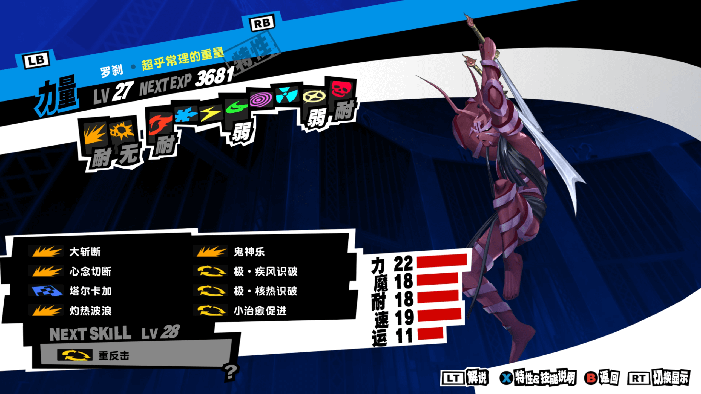
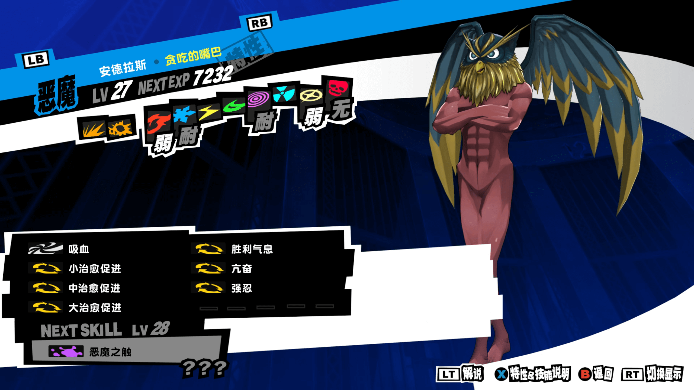
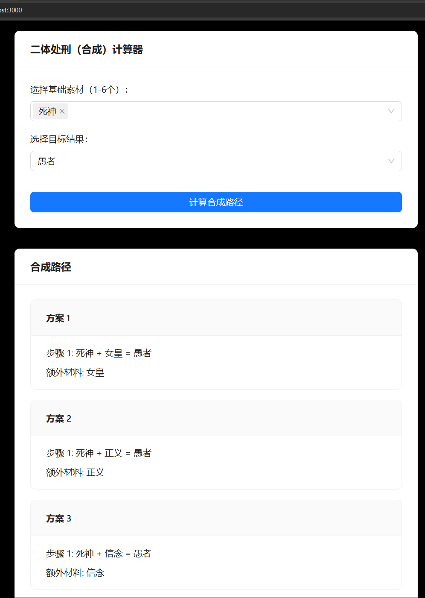
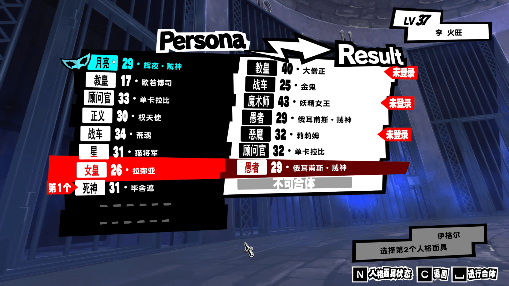
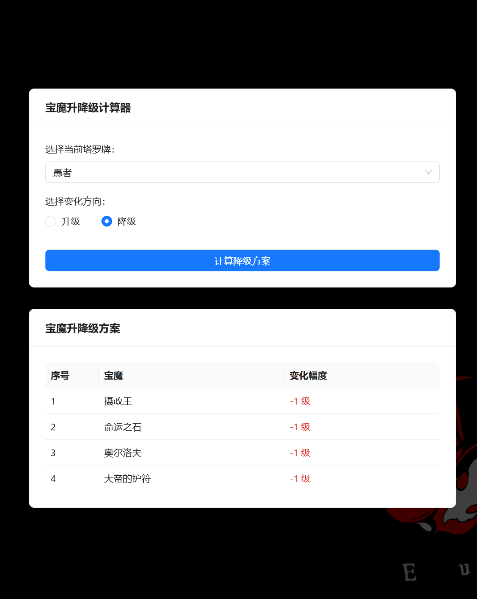
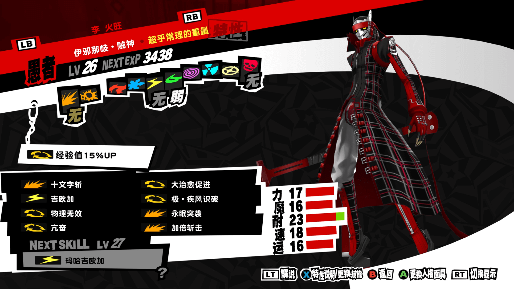

# 女神异闻录5工具

## 目录
- [女神异闻录5工具](#女神异闻录5工具)
  - [目录](#目录)
  - [二体处刑（合成）计算](#二体处刑合成计算)
  - [宝魔升降级计算](#宝魔升降级计算)
  - [参考资料](#参考资料)
  - [其他可用资料](#其他可用资料)

## 二体处刑（合成）计算

提供正向合成路线，方便选技能，到最后一步或者倒数第二步可能需要用到下面的 [宝魔升降级计算](#宝魔升降级计算) 调整面具等级

以下是一个示例：

我35级，想要一个推图用的伊邪那歧·贼神，特殊技能哐哐两下很疼且不费sp，不用一直吃东西，但是物理伤害扣血+本身有风属性缺点

结合手里的面具我选了这两个当材料

补齐了物理20% + 风属性闪避 + 回血，合完查下差个女皇

这里点快了，女皇选高了，合出来个俄尔普斯·贼神，只能用宝魔连续将两级

最终得到想要的面具

## 宝魔升降级计算

原理可见[B站：蒙奇·D·瓦西里](https://www.bilibili.com/opus/722047078518226960)

## 参考资料

- [P5合成范式](https://wiki.biligame.com/persona/P5R/%E5%90%88%E6%88%90%E8%8C%83%E5%BC%8F)

## 其他可用资料

- [P5技能列表](https://wiki.biligame.com/persona/P5R%E6%8A%80%E8%83%BD%E5%88%97%E8%A1%A8)
- [面具合成与宝魔升降法](https://www.bilibili.com/opus/722047078518226960)
- [社区工具](https://zonizuka.github.io/p5r-fusion)
